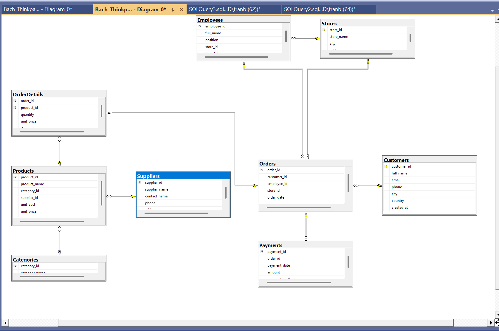
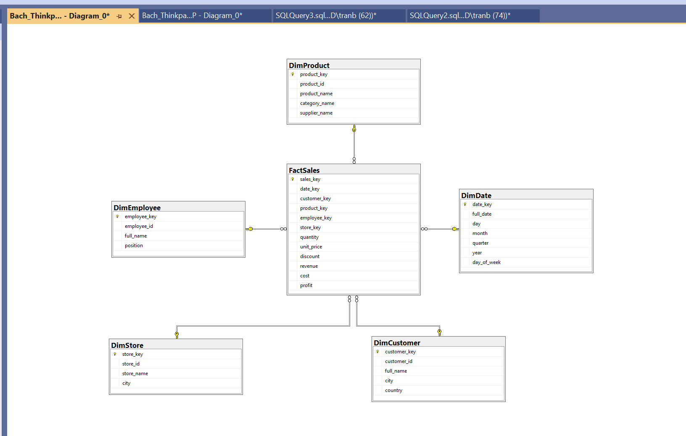

# Data Architecture & Database Modeling

Báo cáo học tập: Kiến trúc dữ liệu và mô hình cơ sở dữ liệu (OLTP/OLAP, ETL/ELT, CAP, ACID/BASE)
Nền tảng thực hành: **Microsoft SQL Server**

---

## 1. Mục tiêu

Hiểu và áp dụng được các khái niệm nền tảng của kiến trúc dữ liệu hiện đại:

- Phân biệt hệ thống **OLTP** (giao dịch) và **OLAP** (phân tích).
- Phân biệt quy trình xử lý dữ liệu **ETL** và **ELT**.
- Hiểu **CAP theorem** và đánh đổi giữa các hệ phân tán.
- Phân biệt mô hình đảm bảo dữ liệu **ACID** (SQL) và **BASE** (NoSQL).
- Thực hành thiết kế schema OLTP và chuyển đổi sang OLAP (star schema) trên SQL Server.

---

## 2. Lý thuyết

### 2.1. OLTP vs OLAP

| Tiêu chí | OLTP (Online Transaction Processing) | OLAP (Online Analytical Processing) |
|---|---|---|
| Mục đích | Xử lý giao dịch nghiệp vụ hàng ngày | Phân tích, hỗ trợ ra quyết định |
| Loại truy vấn | Insert / Update / Delete đơn giản, tần suất cao | Select phức tạp, tổng hợp (aggregate), tần suất thấp |
| Kích thước giao dịch | Nhiều giao dịch nhỏ | Ít giao dịch nhưng xử lý khối lượng lớn dữ liệu |
| Dữ liệu | Chi tiết, cập nhật liên tục (real-time) | Tổng hợp, lịch sử (historical) |
| Thiết kế schema | Chuẩn hóa (3NF) để tránh trùng lặp dữ liệu | Phi chuẩn hóa: Star schema / Snowflake schema |
| Ví dụ hệ thống | Hệ thống bán hàng, ngân hàng, đặt vé | Data warehouse, BI dashboard, báo cáo doanh thu |
| Công cụ SQL Server tương ứng | SQL Server (transactional engine), row-store index | SQL Server + Columnstore Index, hoặc SSAS Cube |

**Tóm tắt:** OLTP tối ưu cho **ghi** (write-heavy), OLAP tối ưu cho **đọc/phân tích** (read-heavy, aggregation-heavy).

### 2.2. ETL vs ELT

| Tiêu chí | ETL (Extract – Transform – Load) | ELT (Extract – Load – Transform) |
|---|---|---|
| Thứ tự xử lý | Biến đổi dữ liệu **trước** khi tải vào kho | Tải dữ liệu thô vào kho **trước**, biến đổi sau |
| Nơi xử lý transform | Máy chủ ETL trung gian (staging area) | Ngay trong data warehouse (tận dụng compute power) |
| Phù hợp với | Dữ liệu có cấu trúc, khối lượng vừa phải | Big data, dữ liệu bán cấu trúc/phi cấu trúc, cloud warehouse |
| Công cụ trong hệ sinh thái Microsoft | SSIS (SQL Server Integration Services) | Azure Data Factory + stored procedures / dbt trên SQL Server |


### 2.3. CAP Theorem

Trong một hệ thống phân tán, chỉ có thể đảm bảo tối đa **2 trong 3** thuộc tính sau tại cùng một thời điểm:

- **C – Consistency (Nhất quán):** Mọi node trả về dữ liệu mới nhất và giống nhau tại cùng thời điểm.
- **A – Availability (Sẵn sàng):** Mọi request đều nhận được phản hồi, kể cả khi có node gặp sự cố.
- **P – Partition tolerance (Chịu phân vùng mạng):** Hệ thống vẫn hoạt động dù mạng giữa các node bị gián đoạn.

| Mô hình | Đánh đổi | Ví dụ hệ thống |
|---|---|---|
| **CP** | Hy sinh Availability khi có sự cố mạng | MongoDB (mặc định), HBase |
| **AP** | Hy sinh Consistency tức thời (eventual consistency) | Cassandra, DynamoDB |
| **CA** | Chỉ khả thi khi không có phân vùng mạng | SQL Server single-node/single-instance truyền thống |


### 2.4. ACID vs BASE

| Tiêu chí | ACID | BASE |
|---|---|---|
| Viết tắt | Atomicity, Consistency, Isolation, Durability | Basically Available, Soft state, Eventual consistency |
| Triết lý | Ưu tiên **tính toàn vẹn** dữ liệu | Ưu tiên **tính sẵn sàng** và khả năng mở rộng |
| Áp dụng cho | CSDL quan hệ: SQL Server, Oracle, MySQL, PostgreSQL | NoSQL: Cassandra, DynamoDB, MongoDB |
| Consistency | Strong consistency | Eventual consistency |
| Khả năng mở rộng | Khó scale ngang | Dễ scale ngang |
| Ví dụ dùng | Giao dịch bán hàng, thanh toán (OLTP) | Feed mạng xã hội, log, dữ liệu IoT |

**Chi tiết ACID:**
- **Atomicity:** Giao dịch hoặc thực hiện toàn bộ, hoặc không thực hiện gì.
- **Consistency:** Giao dịch đưa dữ liệu từ trạng thái hợp lệ này sang trạng thái hợp lệ khác.
- **Isolation:** Các giao dịch chạy song song không ảnh hưởng lẫn nhau (SQL Server hỗ trợ các mức: `READ COMMITTED`, `SNAPSHOT`, `SERIALIZABLE`...).
- **Durability:** Khi giao dịch `COMMIT` thành công, dữ liệu được lưu vĩnh viễn (nhờ transaction log của SQL Server).
- 
**Chi tiết BASE:**
1. Basically Available:
Hệ thống đảm bảo rằng dữ liệu luôn có thể được đọc và ghi (khả dụng), ngay cả khi một phần của hệ thống máy chủ (node) bị lỗi. Thay vì từ chối phục vụ khi có sự cố, hệ thống có thể trả về một dữ liệu cũ hoặc dữ liệu chưa hoàn chỉnh, miễn là người dùng vẫn nhận được phản hồi.

1. Soft State:
Vì hệ thống không yêu cầu sự nhất quán tuyệt đối ngay lập tức, trạng thái của dữ liệu có thể thay đổi liên tục theo thời gian, ngay cả khi không có dữ liệu mới nào được ghi vào. Điều này xảy ra do các node trong hệ thống phân tán đang ngầm đồng bộ hóa dữ liệu với nhau ở background.

1. Eventual Consistency:
Đây là cốt lõi của BASE. Đặc tính này đảm bảo rằng: nếu hệ thống ngừng nhận các bản cập nhật mới, thì "cuối cùng" (eventually) tất cả các node sẽ đồng bộ và chứa cùng một phiên bản dữ liệu giống hệt nhau. Dữ liệu có thể không đồng nhất ở một phần nghìn giây cụ thể, nhưng nó sẽ hội tụ về một trạng thái nhất quán.
---

## 3. Thực hành trên SQL Server

Bài toán mẫu: **Hệ thống bán hàng (Sales System)**

### 3.1. OLTP và OLAP:


```sql
-- Tạo 2 database riêng biệt
CREATE DATABASE SalesOLTP;
GO
CREATE DATABASE SalesDW;
GO
```

### 3.2. Thiết kế OLTP Schema (database: `SalesOLTP`, chuẩn hóa 3NF)


DDL (T-SQL – SQL Server):

```sql
USE SalesOLTP;
GO

CREATE TABLE Suppliers (
    supplier_id     INT IDENTITY(1,1) PRIMARY KEY,
    supplier_name   NVARCHAR(150) NOT NULL,
    contact_name    NVARCHAR(100),
    phone           VARCHAR(20),
    address         NVARCHAR(255)
);

CREATE TABLE Categories (
    category_id     INT IDENTITY(1,1) PRIMARY KEY,
    category_name   NVARCHAR(100) NOT NULL
);

CREATE TABLE Products (
    product_id      INT IDENTITY(1,1) PRIMARY KEY,
    product_name    NVARCHAR(150) NOT NULL,
    category_id     INT FOREIGN KEY REFERENCES Categories(category_id),
    supplier_id     INT FOREIGN KEY REFERENCES Suppliers(supplier_id),
    unit_cost       DECIMAL(12,2) NOT NULL,
    unit_price      DECIMAL(12,2) NOT NULL,
    stock_quantity  INT DEFAULT 0
);

CREATE TABLE Stores (
    store_id        INT IDENTITY(1,1) PRIMARY KEY,
    store_name      NVARCHAR(100) NOT NULL,
    city            NVARCHAR(100),
    address         NVARCHAR(255)
);

CREATE TABLE Employees (
    employee_id     INT IDENTITY(1,1) PRIMARY KEY,
    full_name       NVARCHAR(150) NOT NULL,
    position        NVARCHAR(50),
    store_id        INT FOREIGN KEY REFERENCES Stores(store_id),
    hire_date       DATE
);

CREATE TABLE Customers (
    customer_id     INT IDENTITY(1,1) PRIMARY KEY,
    full_name       NVARCHAR(150) NOT NULL,
    email           VARCHAR(150) UNIQUE,
    phone           VARCHAR(20),
    city            NVARCHAR(100),
    country         NVARCHAR(100),
    created_at      DATETIME2 DEFAULT SYSDATETIME()
);

CREATE TABLE Orders (
    order_id        INT IDENTITY(1,1) PRIMARY KEY,
    customer_id     INT FOREIGN KEY REFERENCES Customers(customer_id),
    employee_id     INT FOREIGN KEY REFERENCES Employees(employee_id),
    store_id        INT FOREIGN KEY REFERENCES Stores(store_id),
    order_date      DATETIME2 DEFAULT SYSDATETIME(),
    status          VARCHAR(20) DEFAULT 'pending'
);

CREATE TABLE OrderDetails (
    order_id        INT FOREIGN KEY REFERENCES Orders(order_id),
    product_id      INT FOREIGN KEY REFERENCES Products(product_id),
    quantity        INT NOT NULL,
    unit_price      DECIMAL(12,2) NOT NULL,
    discount        DECIMAL(5,2) DEFAULT 0,
    PRIMARY KEY (order_id, product_id)
);

CREATE TABLE Payments (
    payment_id      INT IDENTITY(1,1) PRIMARY KEY,
    order_id        INT FOREIGN KEY REFERENCES Orders(order_id),
    payment_date    DATETIME2 DEFAULT SYSDATETIME(),
    amount          DECIMAL(12,2) NOT NULL,
    payment_method  VARCHAR(30)
);
```


### 3.3. Chuyển đổi sang OLAP (database: `SalesDW`, Star Schema)


DDL (T-SQL – SQL Server):

```sql
USE SalesDW;
GO

-- Dimension: Thời gian
CREATE TABLE DimDate (
    date_key        INT PRIMARY KEY,      -- yyyymmdd
    full_date       DATE NOT NULL,
    day             INT,
    month           INT,
    quarter         INT,
    year            INT,
    day_of_week     NVARCHAR(10)
);

-- Dimension: Khách hàng (denormalized)
CREATE TABLE DimCustomer (
    customer_key    INT IDENTITY(1,1) PRIMARY KEY,
    customer_id     INT,                  -- natural key từ SalesOLTP
    full_name       NVARCHAR(150),
    city            NVARCHAR(100),
    country         NVARCHAR(100)
);

-- Dimension: Sản phẩm (denormalized, gộp category + supplier)
CREATE TABLE DimProduct (
    product_key     INT IDENTITY(1,1) PRIMARY KEY,
    product_id      INT,
    product_name    NVARCHAR(150),
    category_name   NVARCHAR(100),
    supplier_name   NVARCHAR(150)
);

-- Dimension: Nhân viên
CREATE TABLE DimEmployee (
    employee_key    INT IDENTITY(1,1) PRIMARY KEY,
    employee_id     INT,
    full_name       NVARCHAR(150),
    position        NVARCHAR(50)
);

-- Dimension: Cửa hàng
CREATE TABLE DimStore (
    store_key       INT IDENTITY(1,1) PRIMARY KEY,
    store_id        INT,
    store_name      NVARCHAR(100),
    city            NVARCHAR(100)
);

-- Fact table: mỗi dòng = 1 sản phẩm trong 1 đơn hàng (grain)
CREATE TABLE FactSales (
    sales_key       INT IDENTITY(1,1) PRIMARY KEY,
    date_key        INT FOREIGN KEY REFERENCES DimDate(date_key),
    customer_key    INT FOREIGN KEY REFERENCES DimCustomer(customer_key),
    product_key     INT FOREIGN KEY REFERENCES DimProduct(product_key),
    employee_key    INT FOREIGN KEY REFERENCES DimEmployee(employee_key),
    store_key       INT FOREIGN KEY REFERENCES DimStore(store_key),
    quantity        INT,
    unit_price      DECIMAL(12,2),
    discount        DECIMAL(5,2),
    revenue         DECIMAL(14,2),        -- quantity * unit_price * (1-discount)
    cost            DECIMAL(14,2),        -- quantity * unit_cost
    profit          DECIMAL(14,2)         -- revenue - cost
);
GO


```


**Ghi chú thiết kế:**
- **Grain (mức chi tiết)** của `FactSales`: 1 dòng = 1 sản phẩm trong 1 đơn hàng.
- Các bảng Dimension được **phi chuẩn hóa** (gộp thông tin liên quan) để giảm số lượng JOIN khi truy vấn.
- Các đo lường (measures) như `revenue`, `cost`, `profit`, `quantity` là **additive** — có thể `SUM` trực tiếp theo mọi chiều.
- Quá trình chuyển từ `SalesOLTP` → `SalesDW` là ví dụ thực tế của **ETL/ELT**: Extract từ các bảng OLTP → Transform (tính revenue/cost/profit, join, gộp dimension) → Load vào `FactSales`/`Dim` tables (bằng SSIS package, Azure Data Factory, hoặc `INSERT INTO ... SELECT` qua Linked Server).


---

## 4. Kết quả đạt được


- [x] Thiết kế được schema OLTP chuẩn hóa (3NF) trên SQL Server cho hệ thống bán hàng.
- [x] Chuyển đổi thành công schema OLTP sang OLAP theo mô hình Star Schema (fact table + dimension tables) trên SQL Server, kèm Columnstore Index.
- [x] Hiểu và phân biệt được OLTP vs OLAP, ETL vs ELT.
- [x] Hiểu CAP theorem.
- [x] Hiểu và phân biệt được ACID (RDBMS) vs BASE (NoSQL).

